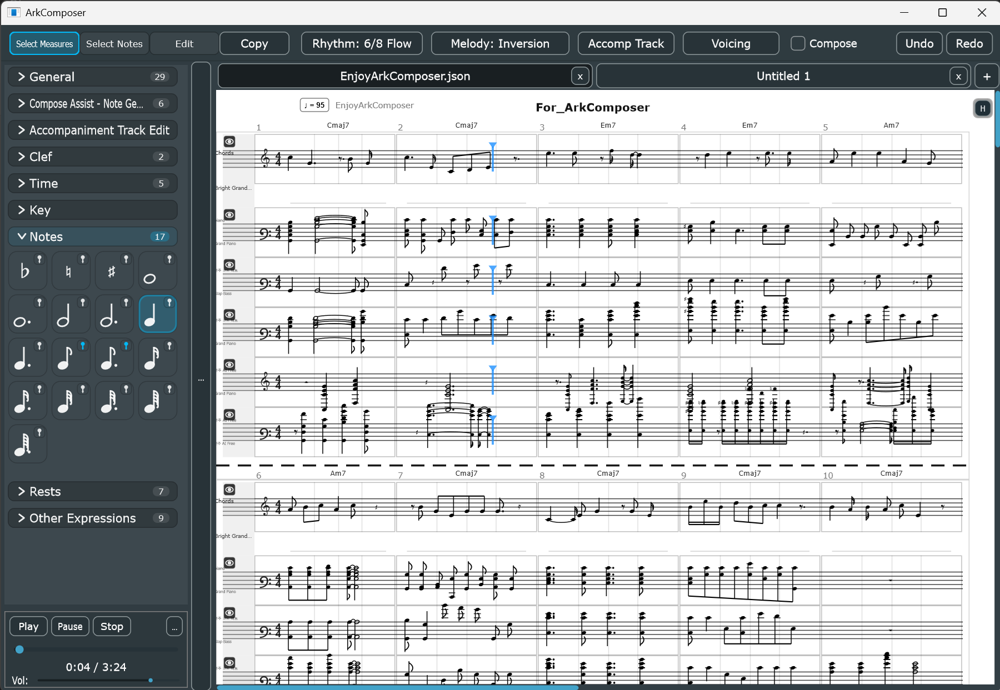

# 🎼 ArkComposer

**AI-native music composition and score editing — powered by MCP**

> Compose, edit, and arrange music through conversation with AI.  
> Connect Claude Code, or any MCP-compatible AI and compose together.



---

## 👨‍💻 About the Author

**Park Byoung Gu (박병구)** ark2010@naver.com

Director & SW Group Manager at **[AXT (Ajinextek)](https://www.ajinextek.com)** — a leading company in industrial motion controller markets — where he leads software R&D.

ArkComposer is a personal hobby project, built on weekends and spare moments, driven by a deep love of music.

---

## ✨ What Makes ArkComposer Different

Most notation software is a tool you *use*. ArkComposer is a tool you *talk to*.

- **MCP Server built-in** — Connect any LLM (Claude, etc.) via stdio or TCP and compose through natural conversation
- **Built-in AI voice leading** — 11 tunable parameters for harmonic lines, chord voicings, and accompaniment generation
- **Full score editor** — Not just a viewer. Notes, rests, expressions, key/time signatures, lyrics, and more
- **Melody & Rhythm Variation** — Inversion, retrograde, augmentation, pentatonic, passing tones, genre-based rhythm patterns
- **Melodic Mood Overlay** — Visual stability/tension analysis on every note (3 color styles)

---

## 🚀 Features

### Score Editing
- Multi-track score editor with treble and bass clef support
- Note input: whole, half, quarter, 8th, 16th, 32nd (+ dotted variants)
- Accidentals, dynamics (p, mf, f, cresc, dim), tempo marks (accel, rit)
- Key signature: major/minor, all 15 keys, 3 apply modes (pitch-fixed / position-fixed / transpose)
- Time signatures: 4/4, 3/4, 2/4, 6/8, 12/8
- Chord symbol display above measures
- Lyrics editor with per-measure editing
- Multi-document tabs with independent undo/redo per tab

### Track Management
- Add, delete, merge, split (by pitch range), reorder tracks
- Hide/show individual tracks
- Per-track instrument settings: SoundFont, Program (0–127), MIDI Channel, Bank MSB/LSB, Volume, Pan, Percussion

### Compose Assist
- **Chord Suggestions** — Analyzes melody, infers chords per measure
- **Voice Leading** — Generates melodic lines with 11 tunable parameters  
  (stepwise bias, tension use, cadence force, leap compensation, common tone hold, and more)
- **Accompaniment Generator** — Arpeggio, Chord Beat, Drum Groove styles
- **Melody Variation** — Inversion, retrograde, augmentation, pentatonic, passing-tone rich
- **Rhythm Variation** — Genre-based and custom pattern reassignment
- **Modes**: Pop, Jazz, Emotional, Functional, Circle of 5ths

### AI Integration via MCP
- Full MCP server built into the app (stdio and TCP modes)
- Compatible with **Claude Code** and any MCP-capable AI client
- Compose through natural language: *"Add a jazz piano accompaniment in measures 5–8"*
- Scope control: next measure / selected range / whole song
- MCP exposes self-documentation — AI clients can fetch tool usage guides automatically

### Audio & Export
- Playback with SoundFont synthesis (.sf2)
- Export audio: **WAV** (lossless) / **MP3** (compressed, requires `lame.exe` in `Tools/`)
- Export score: **PDF** / **PNG** / **JPG**
- Import / Export **MIDI**
- Native save format: `.arkscore` / `.json` (human-readable)

### Plugin Filter Structure
- Built-in audio effect filters (Distortion, Echo, and more)
- Extensible plugin architecture for custom effects

---

## 🤖 AI Composition via MCP

### Mode 1 — stdio (Claude Code) ✅ Tested

Launch ArkComposer in MCP stdio mode:

```bash
ArkComposer.exe --mcp-mode
```

Add to your `claude_desktop_config.json`:

```json
{
  "mcpServers": {
    "arkcomposer": {
      "command": "C:/path/to/ArkComposer.exe",
      "args": ["--mcp-mode"]
    }
  }
}
```

Then talk to Claude Code:
```
"Create an 8-bar melody in C major, 4/4 time"
"Add an arpeggio accompaniment track"
"Apply jazz voice leading to measures 1–4"
"Continue the melody for 4 more measures"
```

### Mode 2 — TCP (Codex CLI and others) ✅ Tested

1. Launch ArkComposer normally
2. In the left palette, click **MCP Server**
3. Enter a TCP port (e.g. `7890`) → Click **Start**
4. Connect your MCP-compatible client to `localhost:7890`

> **Note on ChatGPT:** ChatGPT does not natively support MCP.  
> To use ArkComposer with ChatGPT, you need to implement a separate OpenAPI server that bridges ChatGPT function calls to ArkComposer's MCP tools.

---

## 📋 MCP Tool Surface

ArkComposer exposes a full score editing API over MCP:

| Category | Tools |
|----------|-------|
| Score reading | `get_score`, `get_score_range` |
| Note editing | `add_note`, `add_notes_batch`, `change_note`, `delete_note` |
| Track management | `add_track`, `delete_track`, `set_track_props` |
| Measure management | `add_measure`, `delete_measure`, `delete_measures_range`, `clear_measure`, `set_measure_props` |
| Document | `new_song`, `set_title`, `undo` |

> Full AI usage guide: [`docs/HowToUse_ArkComposerForLLM.md`](docs/HowToUse_ArkComposerForLLM.md)  
> Also available at runtime via MCP resource: `arkcomposer://docs/how-to-use-llm`

---

## 📦 Installation

### Requirements
- Windows 10 / 11 (64-bit)
- `lame.exe` in `Tools/` folder — required for MP3 export ([download](https://lame.sourceforge.io/))

### SoundFonts
Place `.sf2` files in the `SoundFonts/` folder.  
ArkComposer ships with:
- `MuseScore_General.sf2` — MIT License (S. Christian Collins)
- `FluidR3_GM2.sf2` — MIT License (Frank Wen)

### Download
👉 **[Latest Release](https://github.com/arkark2010arkark/ArkComposer/releases/latest)**

---

## 🗺️ Roadmap

- [ ] macOS / Linux support (C++ / JUCE core is cross-platform ready)
- [ ] Cloud sync
- [ ] Plugin marketplace
- [ ] More AI model integrations

---

## 🙏 Credits

| Component | Author | License |
|-----------|--------|---------|
| JUCE Framework | Raw Material Software | JUCE Starter |
| MuseScore_General.sf2 | S. Christian Collins (based on FluidR3 by Frank Wen) | MIT |
| FluidR3_GM2.sf2 | Frank Wen | MIT |
| FluidSynth | Peter Hanappe and contributors | LGPL 2.1 |
| LAME MP3 Encoder | Mark Taylor and contributors | LGPL 2 |
| SDL3 | Sam Lantinga and contributors | zlib |
| libsndfile | Erik de Castro Lopo and contributors | LGPL 2.1 |

See [`CREDITS.txt`](CREDITS.txt) for full details.

---

## 📄 License

ArkComposer is free to download and use.  
Music created with ArkComposer may be used for personal or commercial purposes without restriction.  
Redistribution of ArkComposer itself is not permitted.  
Source code is proprietary and not included in this distribution.

---

*Built with C++ and [JUCE](https://juce.com/)*  
*Website: [arkcomposer.com](https://arkcomposer.com)*  : under
